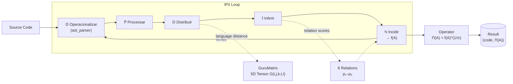

# $\pi\sqrt{f(A)}$: Álgebra Hexarrelacional de Significância para Algoritmos

[](https://python.org)
[](LICENSE)
[](#)

> **Implementação da Álgebra Hexarrelacional de Significância para Algoritmos.**  
> Framework para avaliação semiótica e transpilação semântica iterativa (IPII) via GuruMatrix 5D.

---

## Resumo Teórico

### A Notação $\pi\sqrt{f(A)}$

A notação $\pi\sqrt{f(A)}$ — lê-se *"raiz π-ésima de f de A"* — é o fundamento de uma teoria algébrica de significância para algoritmos, inspirada nos trabalhos de **Leibniz** (cálculo como linguagem do infinito), **Peirce** (semiótica triádica e lógica dos signos) e **Ramanujan** (intuição transcendente nas relações numéricas).

**Definição Canônica:**

$$\Pi : \textbf{Alg} \to \mathbb{R}_{\geq 0}$$

$$\Pi(A) := [f(A)]^{1/\pi} = [f(A)]^{\pi^{-1}}$$

onde $\pi = 3.14159\ldots$ é a constante de Arquimedes e $\pi^{-1} = 0.31830\ldots$ é seu inverso multiplicativo.

O expoente transcendente $1/\pi$ garante a **irredutibilidade**: o resultado não pode ser expresso em forma finita fechada para a maioria dos valores de $f(A)$, conferindo ao operador sua propriedade de *reinscrição no contínuo*.

### Hierarquia Ontológica

| Passo | Expressão | Papel |
|-------|-----------|-------|
| 1 | $A$ | O algoritmo — sequência finita de instruções |
| 2 | $f(A)$ | O algoritmo interpretado — inserido em um contexto de significância |
| 3 | $\sqrt{f(A)}$ | Extração da escala fundamental — comprime picos, eleva mínimos |
| 4 | $[f(A)]^{1/\pi}$ | Reinscrição no contínuo — passagem ao domínio do irracional |

### Os Cinco Modos Operativos

A função $f$ age sobre o algoritmo $A$ por meio de cinco modos (funtores) que formam uma rede comunicante:

| Modo | Símbolo | Descrição |
|------|---------|-----------|
| Operacionalizar | $\mathbb{O}$ | Traz o algoritmo ao domínio real (código-fonte → AST enriquecida) |
| Processar | $\mathbb{P}$ | Transforma passo a passo, percorre e modifica o estado |
| Distribuir | $\mathbb{D}$ | Aloca e reparte o resultado por domínios e nós |
| Inferir | $\mathbb{I}$ | Deriva consequências implícitas (dedução, abdução, indução) |
| Incidir | $\mathbb{N}$ | Projeta o resultado sobre o mundo — dimensão causal |

### As Seis Relações de Significância

Quando $f$ avalia $A$, o resultado é um perfil de significância em seis dimensões hierárquicas:

| Relação | Símbolo | Propriedades | Definição Simbólica |
|---------|---------|--------------|---------------------|
| Similitude | $\rho_1$ | Reflexiva, Simétrica, **Não transitiva** | $x\,\rho_1\,y \iff d(\phi(x),\phi(y)) < \varepsilon$ |
| Homologia | $\rho_2$ | Reflexiva, Transitiva, **Não simétrica** | $x\,\rho_2\,y \iff \exists\, h: \text{Struct}(x) \xrightarrow{\sim} \text{Struct}(y)$ |
| Equivalência | $\rho_3$ | Reflexiva, Simétrica, Transitiva | $x\,\rho_3\,y \iff \forall C: C[x] \simeq C[y]$ |
| Simetria | $\rho_4$ | Reflexiva, Simétrica, Transitiva | $x\,\rho_4\,y \iff \exists T \in \mathcal{G}: T(x)=y \wedge T^{-1}(y)=x$ |
| Equilíbrio | $\rho_5$ | Simétrica, **Não reflexiva**, **Não transitiva** | $x\,\rho_5\,y \iff \Phi(x)+\Phi(y)=0$ |
| Compensação | $\rho_6$ | A mais exigente — implica todas as anteriores | Valor emergente $>$ soma das partes |

### GuruMatrix e IPII

- **GuruMatrix:** Tensor de ordem 5 $G(i,j,k,t,l)$ que cataloga padrões computacionais em cinco dimensões: Categoria Ontológica, Campo Semântico, Nível Hermenêutico, Tempo de Execução e Linguagem-Alvo.
- **IPII (Interação Paramétrica Iterativa por Interoperabilidade):** Protocolo de transpilação semântica que orquestra os 5 modos e avalia a qualidade da transpilação usando as 6 relações, maximizando $\Pi(A)$.

---

## Novas Funcionalidades

### GuruMatrix Dinâmica

A GuruMatrix agora pode **aprender e adaptar-se** a partir de transpilações bem-sucedidas.
Após cada execução do IPII, o método `learn_from_transpilation` ajusta os valores do tensor
nas coordenadas correspondentes ao padrão identificado (categoria ontológica + nível hermenêutico
inferido a partir do score de equivalência + linguagem-alvo).  Isso cria um ciclo de melhoria
contínua: quanto mais transpilações de alta qualidade o sistema realizar, mais precisos tornam-se
os padrões armazenados no tensor.

A GuruMatrix pode ser persistida e carregada em disco via `save`/`load` (formato NumPy `.npy`),
permitindo que o aprendizado acumulado sobreviva entre sessões.

```python
from gurumatrix.tensor import GuruMatrix

gm = GuruMatrix()

# Após uma transpilação bem-sucedida:
gm.learn_from_transpilation(
    source_ast=enriched_ast,
    target_ast=transpiled_code,
    target_lang="javascript",
    pi_score=0.93,
    relation_scores=result.relation_scores,
)

# Salvar e recarregar
gm.save("gurumatrix.npy")
gm.load("gurumatrix.npy")
```

### Integração com LLM no Modo Inferir

O modo Inferir ($\mathbb{I}$) pode agora delegar a pontuação dos candidatos de transpilação a um
**Large Language Model** (LLM) via qualquer API compatível com OpenAI.  O `LLMScorer` constrói
um prompt estruturado que descreve o código-fonte original, o candidato, e as seis relações de
significância — pedindo ao LLM uma nota de 0.0 a 1.0 e uma justificativa breve.  Se o LLM
não estiver disponível (chave ausente ou pacote não instalado), o sistema retorna silenciosamente
ao scorer heurístico interno.

```python
import openai
from core.modes import LLMScorer, build_llm_scorer
from ipii.transpiler import SemanticTranspiler

# Opção 1 — via variável de ambiente OPENAI_API_KEY (automático)
transpiler = SemanticTranspiler(
    llm_client=openai.OpenAI(),   # usa OPENAI_API_KEY do ambiente
)
result = transpiler.transpile(source_code, target_lang="javascript")

# Opção 2 — factory de conveniência (detecta chave automaticamente)
scorer = build_llm_scorer(source_code, target_lang="javascript")
transpiler = SemanticTranspiler(scorer=scorer)
```

### Visualização do Perfil de Significância

A função `plot_significance_profile` gera um **gráfico de radar** (*spider chart*) com os
scores das seis relações de significância (ρ₁–ρ₆) — cada relação em um eixo, numa escala de
0 a 1.  Um polígono grande e equilibrado indica uma transpilação de alta qualidade em todas as
dimensões; eixos deficientes ficam visualmente evidentes.

```python
from utils.visualization import plot_significance_profile

plot_significance_profile(
    result.relation_scores,
    title="Perfil de Significância — Python → JavaScript",
    filepath="significance_profile.png",   # None para exibir interativamente
)
```

O `SemanticTranspiler` pode gerar o gráfico automaticamente ao final de cada transpilação:

```python
transpiler = SemanticTranspiler(
    visualization_filepath="/tmp/profile_{target_lang}.png",
)
```

---

## Arquitetura



### Module Map

```text
algebra-hexarrelacional/
├── core/
│   ├── operator.py      # Π(A) = [f(A)]^(1/π) + convergence theorem
│   ├── modes.py         # 𝕆 ℙ 𝔻 𝕀 ℕ — five operative modes + LLMScorer
│   └── relations.py     # ρ₁–ρ₆ — six significance relations
├── gurumatrix/
│   └── tensor.py        # GuruMatrix: 5D numpy tensor G(i,j,k,t,l) + learning + persistence
├── ipii/
│   ├── ast_parser.py    # Enriched AST with ontological metadata
│   └── transpiler.py    # SemanticTranspiler — IPII orchestration + LLM + visualisation
├── utils/
│   ├── __init__.py
│   └── visualization.py # plot_significance_profile — radar chart for ρ₁–ρ₆
├── examples/
│   └── semantic_transpilation.py  # End-to-end demo (LLM + radar chart + learning)
└── tests/
    ├── test_operator.py   # Convergence theorem proofs
    └── test_relations.py  # Formal property proofs (reflexivity, symmetry …)
```

---

## Instalação

```bash
# Clone the repository
git clone https://github.com/marcabru-tech/algebra-hexarrelacional.git
cd algebra-hexarrelacional

# (Optional) create a virtual environment
python -m venv .venv
source .venv/bin/activate   # Windows: .venv\Scripts\activate

# Install runtime dependencies
pip install -r requirements.txt

# Install dev dependencies (required to run tests)
pip install -r requirements-dev.txt
```

### Integração com LLM (opcional)

Para usar a integração com LLM (`openai`), instale as dependências extras e exporte sua chave de API:

```bash
pip install -r requirements-llm.txt
export OPENAI_API_KEY="sk-..."   # ou qualquer API compatível com OpenAI
```

> **Nota:** A integração com LLM é completamente opcional. Os testes e o núcleo matemático funcionam sem `openai`.

---

## Uso

### Exemplo principal — transpilação semântica

```bash
# Default target: JavaScript
python examples/semantic_transpilation.py

# Custom target language
python examples/semantic_transpilation.py --target rust
python examples/semantic_transpilation.py --target pseudocode
```

### API Python

```python
from ipii.transpiler import SemanticTranspiler
from core.operator import pi_radical_significance, iterate_convergence

# Transpile a Python algorithm to JavaScript
transpiler = SemanticTranspiler(max_iterations=8, tolerance=1e-5)
result = transpiler.transpile(
    source_code="""
def factorial(n: int) -> int:
    if n <= 1:
        return 1
    return n * factorial(n - 1)
""",
    target_lang="javascript",
)

print(result.final_code)
print(f"Π(A) = {result.pi_A:.6f}")   # e.g. Π(A) = 0.948312
print(result.relation_scores)

# Demonstrate Theorem 6.2 — convergence of Π^n(A) → 1
trajectory = iterate_convergence(f_A=result.f_A, n_iterations=10)
for i, val in enumerate(trajectory):
    print(f"  Π^{i}(A) = {val:.8f}")
```

### GuruMatrix

```python
from gurumatrix.tensor import (
    GuruMatrix, OntologicalCategory, SemanticField,
    HermeneuticLevel, ExecutionTime, TargetLanguage,
)

gm = GuruMatrix()
dist = gm.calculate_language_distance(TargetLanguage.PYTHON, TargetLanguage.RUST)
print(f"Python→Rust significance distance: {dist:.4f}")

score = gm.get_pattern(
    OntologicalCategory.RECURSIVE,
    SemanticField.MATHEMATICS,
    HermeneuticLevel.SEMANTIC,
    ExecutionTime.EXPONENTIAL,
    TargetLanguage.PYTHON,
)
print(f"Pattern significance: {score:.4f}")
```

### Testes

```bash
pytest tests/ -v
```

---

## Fundamentos Matemáticos em Destaque

### Teorema 6.2 — Convergência do Operador π-Radical

Para qualquer $f_A > 0$ finito:

$$\lim_{n \to \infty} \Pi^{(n)}(A) = \lim_{n \to \infty} [f(A)]^{(1/\pi)^n} = 1$$

porque $(1/\pi)^n \to 0$ e $x^0 = 1$ para todo $x > 0$.  
Verificado em `tests/test_operator.py::TestIterateConvergence::test_convergence_to_one`.

### Não-transitividade de $\rho_1$

A Similitude é reflexiva e simétrica mas **não transitiva**: existem $x, y, z$ tais que $\rho_1(x,y) > \varepsilon$ e $\rho_1(y,z) > \varepsilon$ mas $\rho_1(x,z) \leq \varepsilon$.  
Documentado em `tests/test_relations.py::TestSimilitude::test_not_transitive_in_general`.

---

## Citação

Se você utilizar este trabalho em pesquisa acadêmica, por favor cite:

```bibtex
@software{pi_root_f_A,
  title        = {$\pi\sqrt{f(A)}$: Álgebra Hexarrelacional de Significância para Algoritmos},
  author       = Guilherme Gonçalves Machado
  year         = {2026},
  url          = {https://github.com/marcabru-tech/algebra-hexarrelacional},
  note         = {PoC/MVP da teoria de avaliação semiótica e transpilação semântica iterativa (IPII) via GuruMatrix 5D},
}
```

---

## Licença

Distribuído sob a licença **Apache 2.0**. Consulte o arquivo [LICENSE](LICENSE) para detalhes.

---

## Tópicos

`mathematics` · `semiotics` · `computational-linguistics` · `compiler-design` · `algebra` · `algorithm-analysis` · `transpiler` · `python` · `formal-methods`
